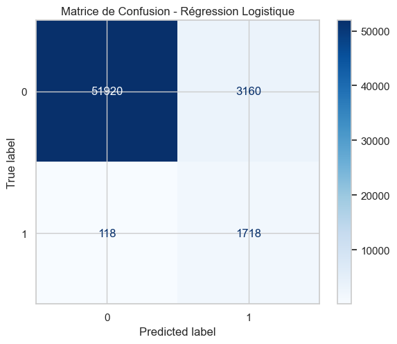
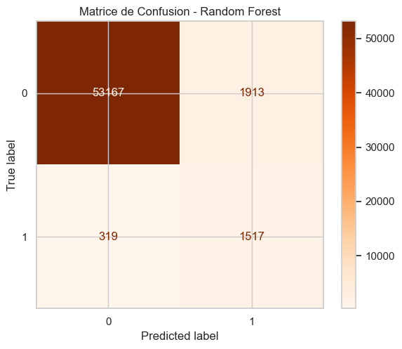
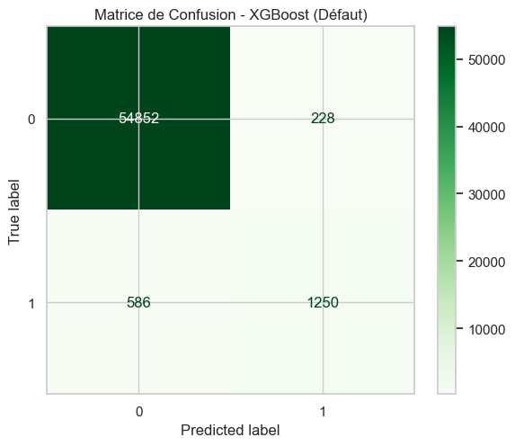
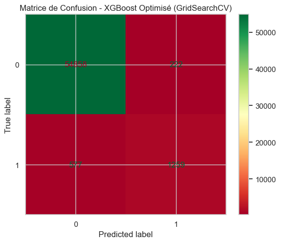
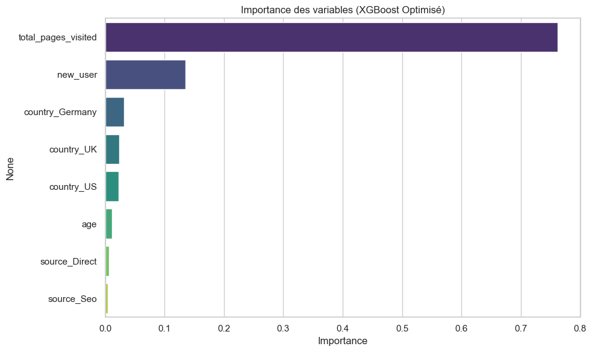
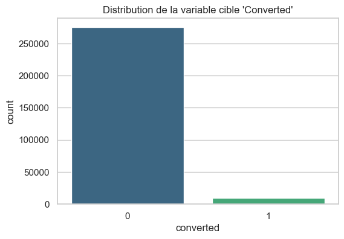
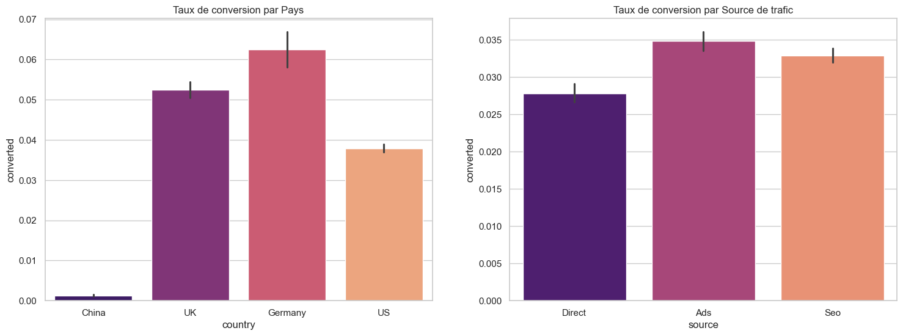
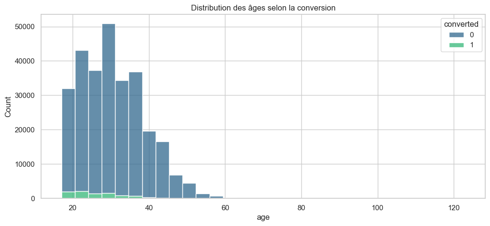
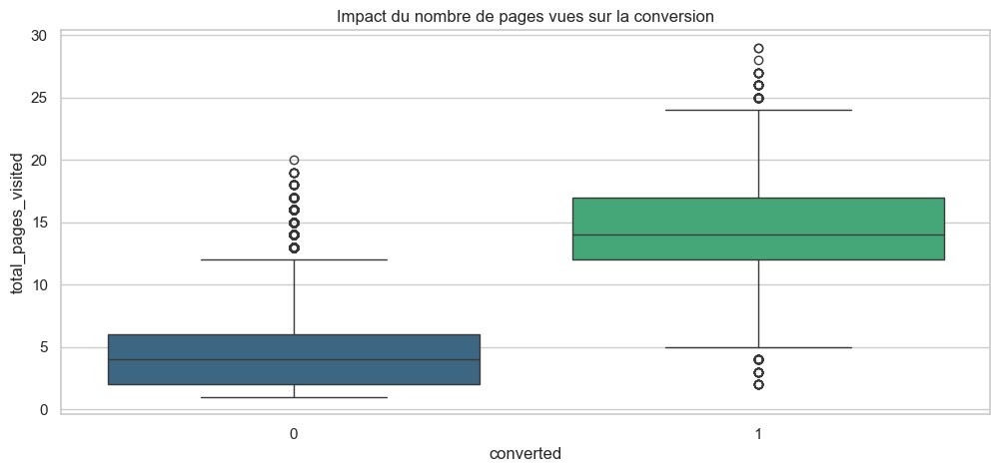

# 📈 Conversion Rate Challenge - Prediction de Newsletter


## 📋 Contexte du Projet

**datascienceweekly.org** est une newsletter curatee par des data scientists independants. L'equipe souhaite predire si un visiteur va s'abonner a la newsletter en fonction de son comportement de navigation et de ses caracteristiques demographiques.

Le projet s'inscrit dans un **challenge de Machine Learning** (format Kaggle) : construire le modele avec le meilleur **F1-Score** sur la prediction des conversions.

**Pourquoi le F1-Score ?** Le dataset est tres desequilibre (3.23% de conversions). L'Accuracy est inadaptee : un modele "naif" qui predit toujours 0 atteindrait 96.8% sans rien detecter. Le F1-Score, moyenne harmonique de la precision et du recall, penalise les modeles qui sacrifient l'un ou l'autre. C'est aussi la metrique imposee par le challenge.

## 🎯 Resultats

### Comparaison des modeles

| Modele | Type | Precision | Recall | F1 (Test) | F1 (CV 3-fold) |
|--------|------|:---------:|:------:|:---------:|:--------------:|
| Logistic Regression | Lineaire (Baseline) | 0.35 | 0.94 | 0.5118 | 0.5111 +/- 0.0014 |
| Random Forest | Ensemble - Bagging | 0.44 | 0.83 | 0.5761 | 0.5754 +/- 0.0053 |
| XGBoost (defaut) | Ensemble - Boosting | 0.85 | 0.68 | 0.7544 | 0.7561 +/- 0.0074 |
| **XGBoost (optimise)** | **Ensemble - Boosting** | **0.85** | **0.69** | **0.7591** | **0.7650 +/- 0.0069** |

- Les scores CV et test sont proches pour chaque modele : **pas d'overfitting**.
- Le XGBoost optimise offre le meilleur equilibre precision/recall.

### Matrices de confusion

<p align="center">
  
  
</p>
<p align="center">
  
  
</p>

La Logistic Regression detecte 94% des convertis mais genere enormement de faux positifs (precision = 35%). Le XGBoost optimise trouve le meilleur compromis : 85% de precision pour 69% de recall.

### Feature Importance et leviers d'action

<p align="center">
  
</p>

| Variable | Impact | Recommandation |
|----------|--------|---------------|
| `total_pages_visited` | Predicteur dominant. Au-dela de 12-15 pages, conversion quasi-certaine | Inciter la navigation : liens internes, suggestions d'articles, contenu interactif |
| `age` | Les 18-30 ans convertissent davantage | Cibler les campagnes marketing sur cette tranche |
| `new_user` | Les utilisateurs recurrents convertissent mieux | Strategie de retargeting pour faire revenir les visiteurs |
| `country` | Disparites geographiques (China/US legerement au-dessus) | Adapter le contenu ou le timing des newsletters par region |

---

## 🏗️ Pipeline Technique

### 1. Exploration (EDA)

**Dataset** : 284 580 lignes, 6 colonnes, aucune valeur manquante.

| Variable | Type | Description |
|----------|------|-------------|
| `country` | Categorielle (4 modalites) | US, UK, China, Germany |
| `age` | Numerique | 17-123 ans |
| `new_user` | Binaire | 0 = recurrent, 1 = nouveau |
| `source` | Categorielle (3 modalites) | Ads, Direct, Seo |
| `total_pages_visited` | Numerique | 1-29 pages |
| `converted` | Binaire (target) | 0 = non, 1 = oui |

Taux de conversion : **3.23%** (9 186 / 284 580).

<p align="center">
  
</p>

**Analyse par variable :**

<p align="center">
  
</p>

<p align="center">
  
  
</p>

**Nettoyage** : 2 lignes avec age = 123 ans supprimees (erreurs de saisie). Dataset final : **284 578 lignes**.

### 2. Preprocessing

| Etape | Methode | Pourquoi |
|-------|---------|----------|
| Encodage | `pd.get_dummies(drop_first=True)` | One-Hot Encoding des categorielles. `drop_first` evite la multicolinearite |
| Split | `train_test_split(stratify=y, test_size=0.2)` | `stratify` preserve le ratio 96.77/3.23 dans train et test |
| Normalisation | `StandardScaler` | Necessaire pour la Logistic Regression (descente de gradient). fit sur le train, transform sur le test pour eviter le data leakage |

### 3. Modelisation

**4 modeles de complexite croissante** :

1. **Logistic Regression** (`class_weight='balanced'`) : Baseline lineaire. `balanced` ajuste les poids inversement proportionnels a la frequence des classes.
2. **Random Forest** (100 arbres, `class_weight='balanced'`) : Ensemble par **bagging** (arbres en parallele, vote majoritaire). Reduit la variance par rapport a un arbre unique.
3. **XGBoost** (defaut) : Ensemble par **boosting** (arbres sequentiels, chaque arbre corrige les erreurs du precedent). Reduit biais et variance.
4. **XGBoost** (optimise par GridSearchCV) : Meilleur modele retenu.

### 4. Optimisation (GridSearchCV)

Recherche exhaustive sur une grille d'hyperparametres, avec cross-validation 3-fold et F1-Score comme metrique :

| Parametre | Role | Valeurs testees | Retenu |
|-----------|------|-----------------|--------|
| `max_depth` | Profondeur max de chaque arbre | 3, 5, 7 | **7** |
| `learning_rate` | Taux d'apprentissage du boosting | 0.05, 0.1, 0.2 | **0.1** |
| `n_estimators` | Nombre d'arbres | 100, 200 | **100** |

18 combinaisons x 3 folds = **54 fits**. cv=3 est suffisant ici : avec ~228K lignes d'entrainement, chaque fold fait ~76K lignes.

### 5. Submission

Le meilleur modele est applique sur `conversion_data_test.csv` (31 620 lignes) avec le meme preprocessing :
- `get_dummies` + `reindex` pour aligner les colonnes avec le train
- `scaler.transform` (pas `fit_transform`) pour eviter le data leakage
- Les outliers du test ne sont **pas** supprimes : une prediction est requise pour chaque ligne

---

## 🚀 Installation et Execution

```bash
git clone https://github.com/athanormark/Conversion_Rate-BLOC-3_JEDHA_FORMATION.git
cd Conversion_Rate-BLOC-3_JEDHA_FORMATION
pip install -r requirements.txt
```

Placer `conversion_data_train.csv` et `conversion_data_test.csv` dans `data/raw/`, puis :

```bash
jupyter notebook notebooks/1.0-eda-model-training.ipynb
```

### Structure du Projet

```text
conversion_rate_project/
├── data/
│   ├── raw/                  # Donnees brutes (non versionnees)
│   └── processed/            # submission.csv generee
├── notebooks/
│   └── 1.0-eda-model-training.ipynb
├── assets/
│   └── images/               # Graphiques du notebook
├── .gitignore
├── requirements.txt
└── README.md
```

## 👤 Auteur
Athanor SAVOUILLAN
